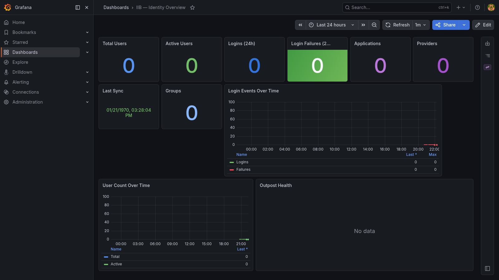

# IIB — Identity in a Box

One `make up` for self-hosted identity and access management. Part of the **in-a-box-tools** ecosystem.



```
make up
```

Brings up:
- **Authentik** — IdP with OIDC, SAML, LDAP, SCIM, MFA, SSO (ports 9080/9443)
- **iib-monitor** — polls Authentik API and pushes metrics to VictoriaMetrics
- **VictoriaMetrics** — time-series metrics storage (port 8432)
- **Grafana** — pre-built identity overview dashboard (port 3004)

---

## Quick start

```bash
make up
# Secrets are auto-generated on first run — no manual .env editing required
```

On first run `make` will:
1. Copy `.env.example` → `.env`
2. Generate `AUTHENTIK_SECRET_KEY`, `AUTHENTIK_BOOTSTRAP_TOKEN`, and `POSTGRES_PASSWORD`
3. Start all services

Open Authentik at http://localhost:9080 — log in with the credentials from `.env` (`AUTHENTIK_BOOTSTRAP_EMAIL` / `AUTHENTIK_BOOTSTRAP_PASSWORD`).

Open Grafana at http://localhost:3004 — the IIB Overview dashboard loads automatically (admin / your `GRAFANA_ADMIN_PASSWORD`).

---

## Port table

| Service | Host port | Container port | Default |
|---------|-----------|----------------|---------|
| Authentik HTTP | `AUTHENTIK_PORT_HTTP` | 9000 | 9080 |
| Authentik HTTPS | `AUTHENTIK_PORT_HTTPS` | 9443 | 9443 |
| VictoriaMetrics | `VICTORIAMETRICS_PORT` | 8428 | 8432 |
| Grafana | `GRAFANA_PORT` | 3000 | 3004 |

---

## Configuration

Edit `.env` before first run (or regenerate with `make generate-secrets`):

| Variable | Default | Description |
|----------|---------|-------------|
| `GRAFANA_ADMIN_PASSWORD` | `CHANGE_ME` | Grafana admin password |
| `AUTHENTIK_BOOTSTRAP_EMAIL` | `admin@localhost` | Initial admin email |
| `AUTHENTIK_BOOTSTRAP_PASSWORD` | `CHANGE_ME` | Initial admin password |
| `SYNC_INTERVAL_MINUTES` | `15` | How often the monitor polls Authentik |
| `LOOKBACK_HOURS` | `24` | Window for login event counts |
| `VICTORIAMETRICS_RETENTION` | `90d` | Metric retention period |

Auto-generated on first run (do not set manually):

| Variable | Description |
|----------|-------------|
| `AUTHENTIK_SECRET_KEY` | Django signing key |
| `AUTHENTIK_BOOTSTRAP_TOKEN` | API token for the monitor |
| `POSTGRES_PASSWORD` | PostgreSQL password |

---

## Metrics

Collected by `iib-monitor` and pushed to VictoriaMetrics every `SYNC_INTERVAL_MINUTES`.

| Metric | Labels | Description |
|--------|--------|-------------|
| `iib_users_total` | — | All users |
| `iib_users_active` | — | Active users |
| `iib_users_superuser` | — | Superuser accounts |
| `iib_logins_total` | `window` | Successful logins in lookback window |
| `iib_login_failures_total` | `window` | Failed logins in lookback window |
| `iib_password_changes_total` | `window` | Password set events in lookback window |
| `iib_applications_total` | — | Configured applications |
| `iib_providers_total` | — | Configured providers |
| `iib_groups_total` | — | Groups |
| `iib_outpost_healthy` | `name`, `type` | Outpost health (1=healthy, 0=unhealthy) |
| `iib_last_sync_timestamp` | — | Unix ms timestamp of last successful sync |

---

## Grafana dashboard

The **IIB Overview** dashboard (`uid: iib-overview`) is provisioned automatically. Panels:

1. Total Users
2. Active Users
3. Logins (24h window)
4. Login Failures (red if > 0)
5. Applications count
6. Providers count
7. Last Sync timestamp
8. Groups count
9. Login Events Over Time (logins + failures)
10. User Count Over Time (total + active)
11. Outpost Health table (Healthy/Unhealthy)

---

## Makefile targets

| Target | Description |
|--------|-------------|
| `make up` | Start all services (generates secrets on first run) |
| `make down` | Stop all services |
| `make restart` | Restart all services |
| `make build` | Rebuild monitor image |
| `make logs` | Follow all service logs |
| `make generate-secrets` | Re-run secret generation (skips if already set) |
| `make sync-now` | Trigger an immediate metrics sync |
| `make clean` | Stop services and remove all volumes |

---

## Data persistence

| Volume | Contents |
|--------|----------|
| `iib-postgres-data` | Authentik PostgreSQL database |
| `iib-redis-data` | Authentik Redis state |
| `iib-authentik-media` | Uploaded media (avatars, branding) |
| `iib-authentik-templates` | Custom email/UI templates |
| `iib-victoriametrics-data` | VictoriaMetrics TSDB (90d default retention) |
| `iib-grafana-data` | Grafana state, user preferences |

---

## In-a-box ecosystem

| Tool | What it does |
|------|-------------|
| [VIB](https://github.com/matijazezelj/vib) | Vulnerability in a Box — CVE scanning |
| [TIB](https://github.com/matijazezelj/tib) | Threat Intelligence in a Box — KEV + EPSS |
| [CIB](https://github.com/matijazezelj/cib) | Compliance in a Box — policy + license + EOL |
| **IIB** | **Identity in a Box** |
| [PIB](https://github.com/matijazezelj/pib) | PKI in a Box — internal CA + cert expiry monitor |
| [XIB](https://github.com/matijazezelj/xib) | Security in a Box — unified umbrella dashboard |

---

## License

MIT
